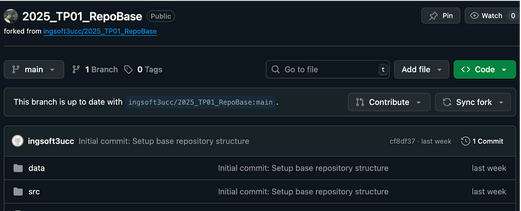
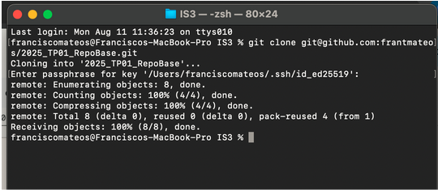
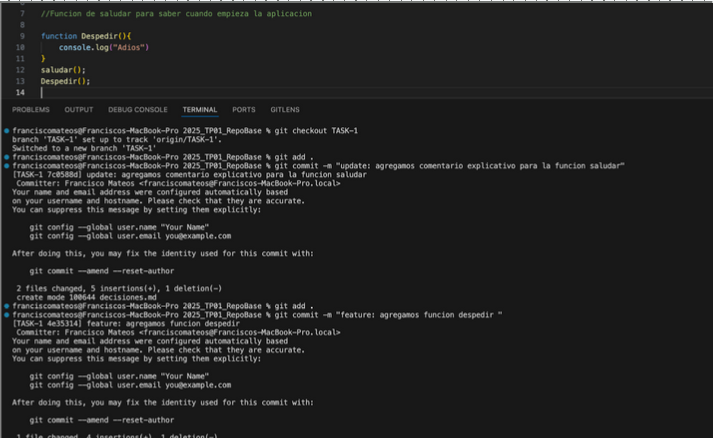
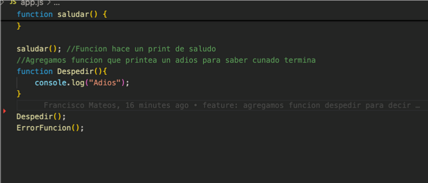
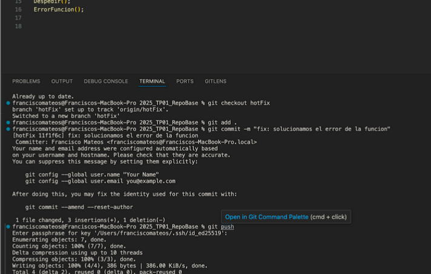
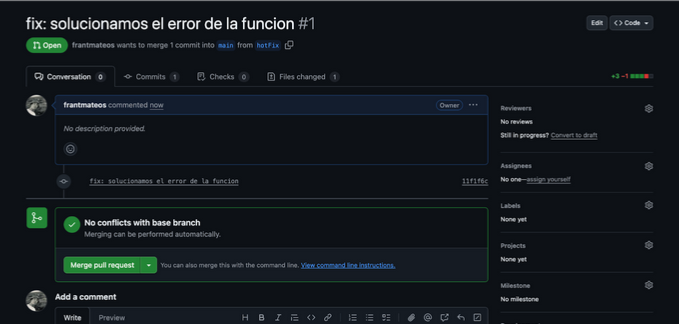
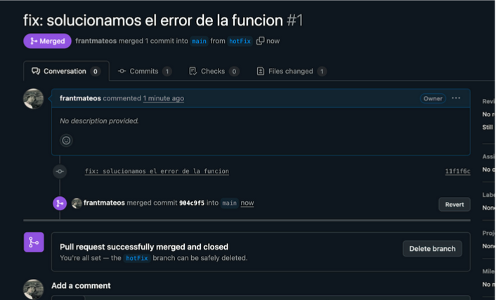
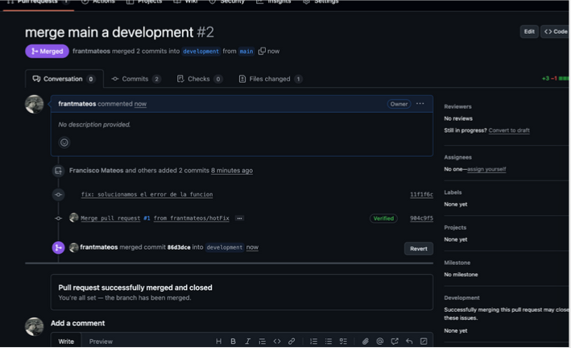
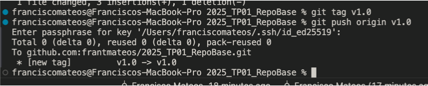

#Paso 1. 
Forkeamos el repo 

Clones el repo con SSH(mayor seguridad)

Creamos la rama secundaria

Usamos el repositorio y hacemos dos cambios separados con sus respectivos commits 

Lo que hicimos fue movernos a nuestra rama que creamos para poder trabajar en nuestra tarea( creamos la función despedir) e hicimos dos commits, uno para cada momento que se hizo un cambio. El primero fue cuando se agregó el comentario y el segundo cuando agregamos la función despedir. Estos commits son para la rama TASk-1 donde estamos trabajando

Solucion de error 

Supongamos que encontramos un error en producción, en este caso la función ErrorFuncion nunca fue definida. Entonces para arreglar este error que debemos solucionar de manera inmediata, sacamos una rama de main para obtener la misma version que tiene el error y solucionamos el error en esa rama

Entonces lo que hicimos fue trabajar en esa rama para solucionar el error, ahora para poder aplicar esos cambios en producción para que no falle mas podriamos hacer con un merge. Eso sería pasarse a la rama “main” y hacer un “git merge hotFix”. y los cambios de la rama hotFix se pasarían a la rama main. En este caso lo vamos a hacer con PRs para hacer el paso 5 también y para actualizar las rama de development también.

Creamos la PR que va directo a main para el cambio(como no tenemos un pipeline que limite los cambio a main directo vamos a poder ver reflejado el cambio) en caso de tener un pipeline que pida que lo cambios se hagan de la rama de staging, deberíamos hacer el cambio a staging y después hacer una  PR de staging a main, pero no es el caso.
Mergeamos

Hacemos lo mismo de la PR pero de main a development para que esta tambien quede actualizada 

Agregamos un tag en nuestro main para marcar una instancia importante en producción, por ejemplo la versión inicial funcionado.

