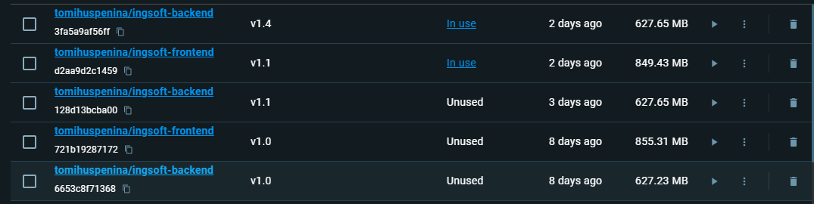
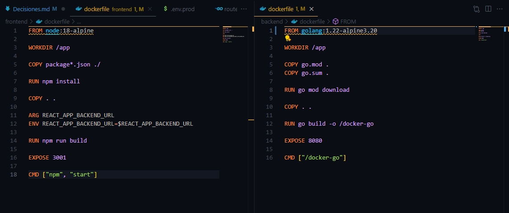
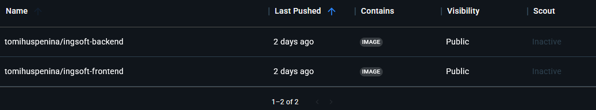
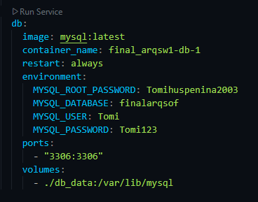

# paso 1:

# paso 2:
Alias backend:
  usamos: docker build -t tomihuspenina/ingsoft-backend:v1.4 -f backend/Dockerfile backend

Alias frontend:
  usamos: docker build -t tomihuspenina/ingsoft-frontend:v1.1 -f frontend/Dockerfile frontend

Imágenes en docker desktop:

Dockerfiles:

Elegimos las imagenes de golang 1.22 y node 18-alpine por que son imagenes oficales, actualizadas y ligeras.

# paso 3:
Push de imagenes a docker hub:
usamos los comandos: 
  docker push tomihuspenina/ingsoft-backend:v1.4
  docker push tomihuspenina/ingsoft-frontend:v1.1

Imagen de backend: https://hub.docker.com/r/tomihuspenina/ingsoft-backend
Imagen de frontend: https://hub.docker.com/r/tomihuspenina/ingsoft-frontend

# paso 4:
  Elegimos MySQL por que ya la veniamos trabajando en materias anteriores, por lo que tenemos conocimiento de su funcionalidad y además tenemos los entornos instalados.

Volumen y conexión: 

 #Image: Usamos la imagen de MySQL en su ultima version
 #Container_name: Nombre que le damos al contenedor
 #Restart always: Si el contenedor se caer, docker lo reinicia automaticamente
 #Enviroment: variables del ambiente que MySQL entiende, en ella definimos usario y contraseña root y tambien otro usario y contraseña normal
 #Ports: Puertos que usara SQL
 #Volumes: Para que los datos queden en caso de borrar o cambiar el contenedor

# paso 5 y 6:
 Docker compose:

 //
 services:
  db_qa:
    image: mysql:8.0.43
    container_name: db_qa
    restart: always
    environment:
      MYSQL_ROOT_PASSWORD: rootqa
      MYSQL_DATABASE: arqsoft1cursos_qa
      MYSQL_USER: appqa
      MYSQL_PASSWORD: QaPass
    volumes:
      - db_data_qa:/var/lib/mysql
      - ./db/init/qa:/docker-entrypoint-initdb.d
    healthcheck:
      test: ["CMD-SHELL", "mysqladmin ping -h 127.0.0.1 -u$$MYSQL_USER -p\"$$MYSQL_PASSWORD\""]
      interval: 10s
      timeout: 5s
      retries: 20

  backend_qa:
    image: tomihuspenina/ingsoft-backend:v1.4
    container_name: backend_qa
    environment:
      APP_ENV: qa
      PORT: 8080
      DB_HOST: db_qa
      DB_PORT: 3306
      DB_USER: appqa
      DB_PASS: QaPass
      DB_NAME: arqsoft1cursos_qa
      LOG_LEVEL: debug
    ports: ["8081:8080"]
    depends_on:
      db_qa:
        condition: service_healthy
    restart: on-failure
    volumes:
      - ./backend/uploads:/app/uploads

  db_prod:
    image: mysql:8.0.43
    container_name: db_prod
    restart: always
    environment:
      MYSQL_ROOT_PASSWORD: superProd!
      MYSQL_DATABASE: arqsoft1cursos_prod
      MYSQL_USER: app
      MYSQL_PASSWORD: ProdPass
    volumes:
      - db_data_prod:/var/lib/mysql
      - ./db/init/prod:/docker-entrypoint-initdb.d
    healthcheck:
      test: ["CMD-SHELL", "mysqladmin ping -h 127.0.0.1 -u$$MYSQL_USER -p\"$$MYSQL_PASSWORD\""]
      interval: 10s
      timeout: 5s
      retries: 20

  backend_prod:
    image: tomihuspenina/ingsoft-backend:v1.4
    container_name: backend_prod
    environment:
      APP_ENV: prod
      PORT: 8080
      DB_HOST: db_prod
      DB_PORT: 3306
      DB_USER: app
      DB_PASS: ProdPass
      DB_NAME: arqsoft1cursos_prod
      LOG_LEVEL: info
    ports: ["8080:8080"]
    depends_on:
      db_prod:
        condition: service_healthy
    restart: on-failure
    volumes:
      - ./backend/uploads:/app/uploads

  frontend_prod:
    image: tomihuspenina/ingsoft-frontend:v1.1
    environment:
      HOST: 0.0.0.0
      REACT_APP_BACKEND_URL: "http://localhost:8080"
    ports: ["3000:3000"]
    depends_on: [backend_prod]

  frontend_qa:
    image: tomihuspenina/ingsoft-frontend:v1.1
    environment:
      HOST: 0.0.0.0
      REACT_APP_BACKEND_URL: "http://localhost:8081"
    ports: ["3001:3000"]
    depends_on: [backend_qa]

volumes:
  db_data_qa: {}
  db_data_prod: {}
 //

 #Imagen backend: tomihuspenina/ingsoft-backend:v1.4
 #Imagen frontend: tomihuspenina/ingsoft-frontend:v1.1
 #Imagen db: mysql:8.0.43

# paso 7:
 #backend v1.0: Primera prueba de imagen del backend
 #backend v1.1: Cambio en los ajustes de la base de datos en db.go, no lee mas localhost
 #backend v1.2: Mas ajustes en db.go
 #backend v1.3: Agregado de CORS
 #backend v1.4: Arrglo de los CORS y Puertos

 #frontend v1.0: Primera prueba de imagen del frontend
 #frontend v1.1: Agregado de la url para QA y PROD
