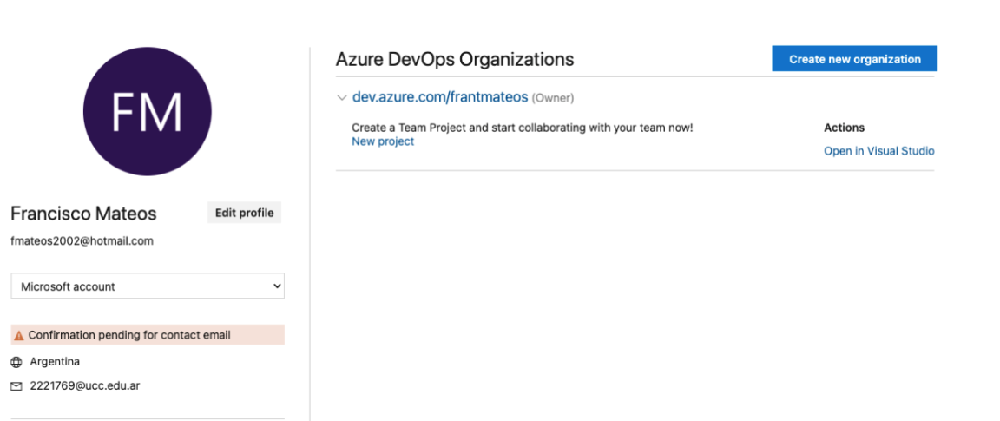

# Trabajo Practico 3

# Alumnos: Francisco Tomas Mateos y Tomas Huspenina

## Paso 1
creamos la organizacion

## Paso2
Creamos un proyecto

## Paso 3
Creamos un nuevo team, e este caso developers

## Paso 4
Tambien creamos una nueva Area, donde despues podriasmos asiganr tareas, etc. 

## Paso 5
Pasamos a crear diversas tarea para nuestra organizacion
- 1 Epic
- 3 User Stories
- 2 tasks por user Story
- 2 bugs

