# Trabajo Práctico 04 – Azure DevOps Pipelines (2025)

# Alumnos: Francisco Tomas Mateos y Tomas Huspenina

# 🎯 Objetivo
Construir un pipeline CI en YAML para una aplicación a elección que tenga frontend y backend usando un agente Self‑Hosted.

Este trabajo se aprueba solo si podés explicar qué hiciste, por qué lo hiciste y cómo lo resolviste.

## Pasos realizados: 

## Paso 1

Creamos nuestro PAT
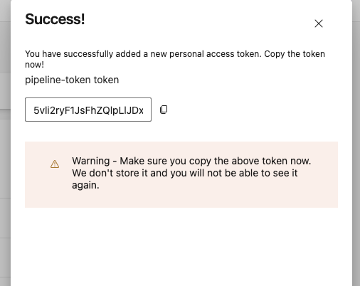

## Paso 2

Creamos nuestro agent pool
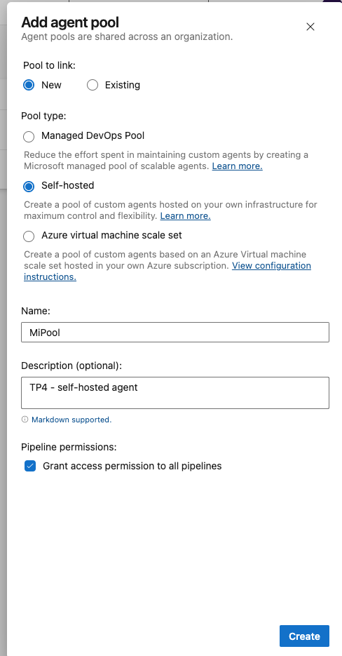

## Paso 3

Pasamos a cofigurar muestro agente en nuesto entorno
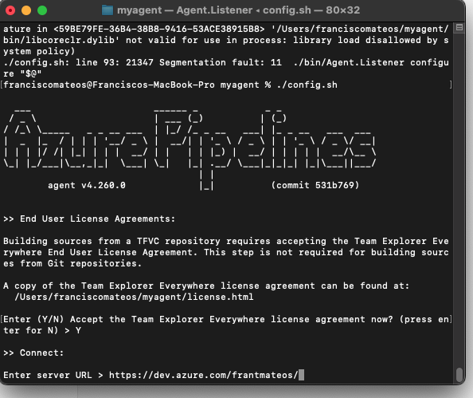
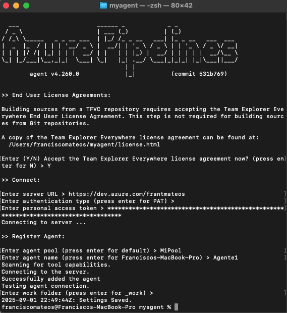
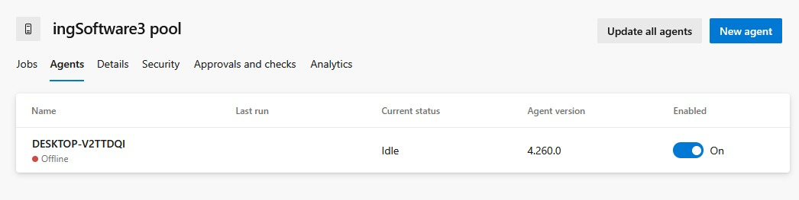

## Paso 4

Pasamos a crear nuestro pipeline
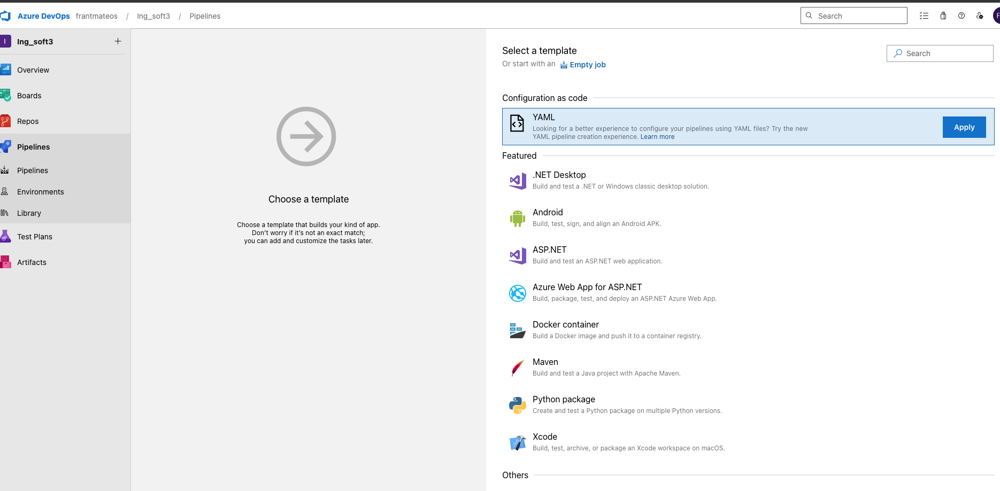

Asignamos nuesro agente y el .yml de nuestro repo en azure
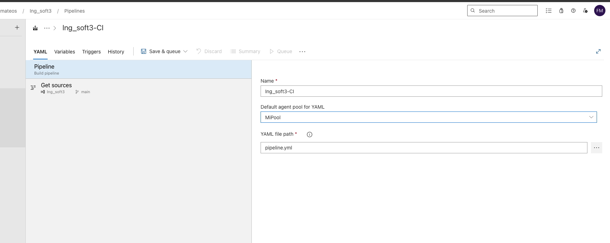
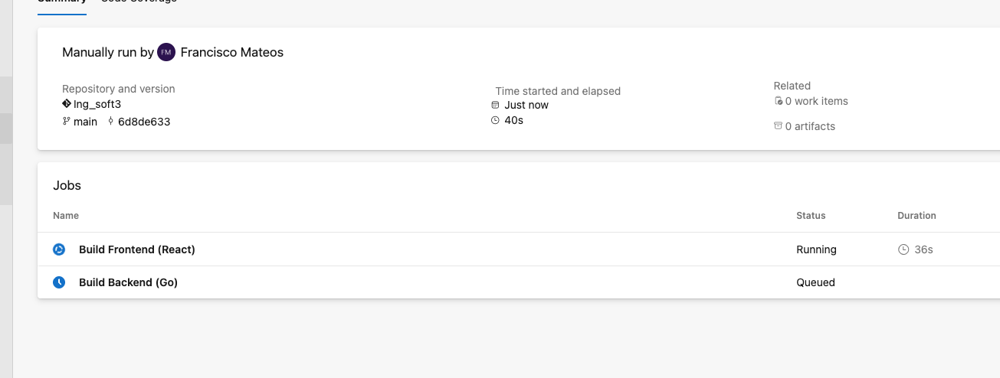

## Paso 5

Pasamos a testearlo con un run
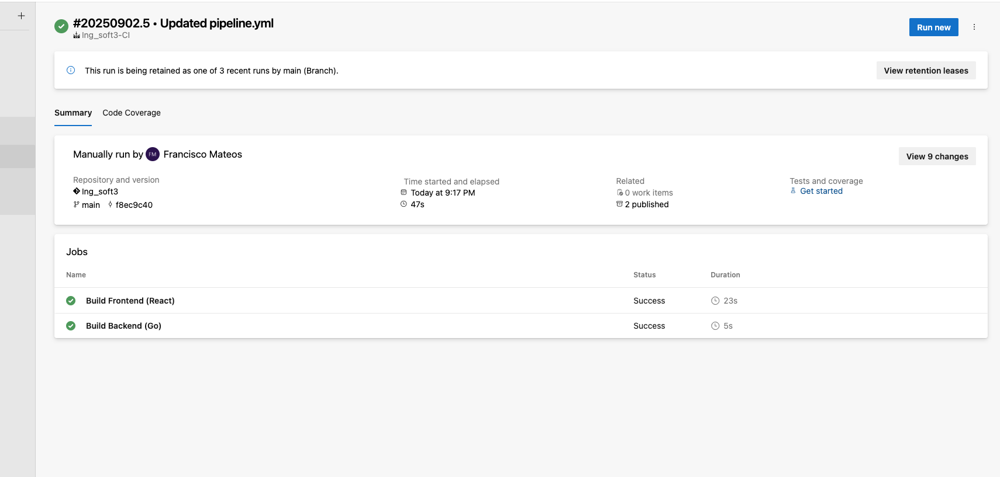
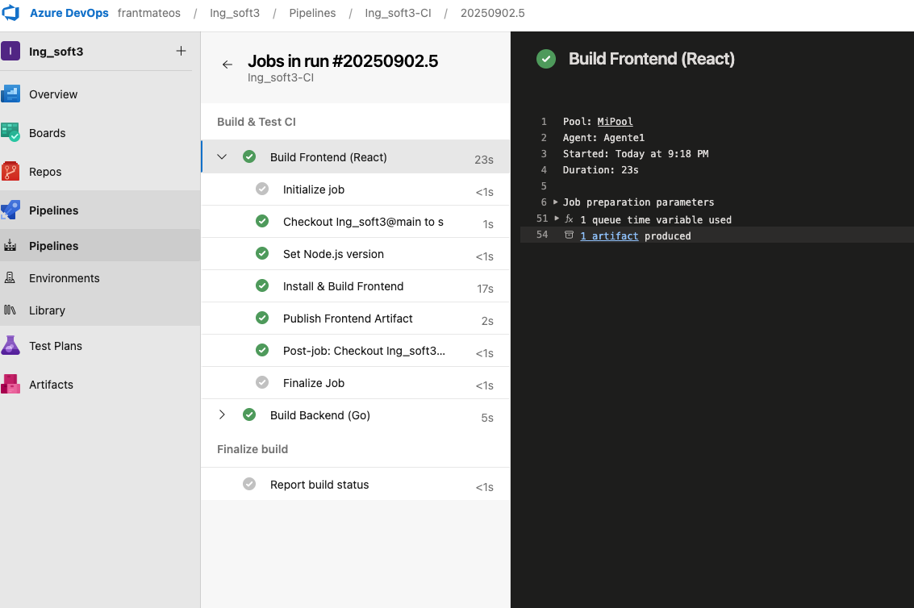
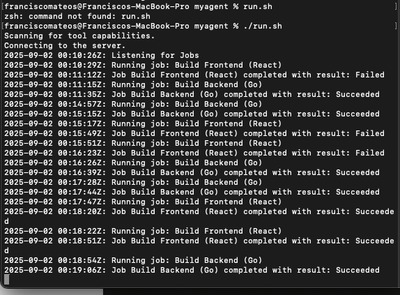

## Paso 5

Vemso los artefact
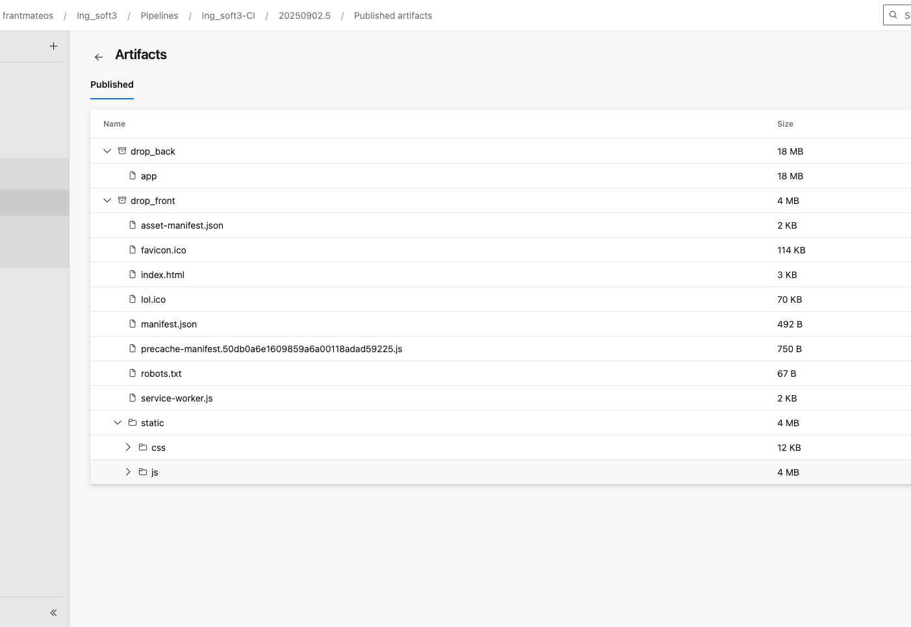

