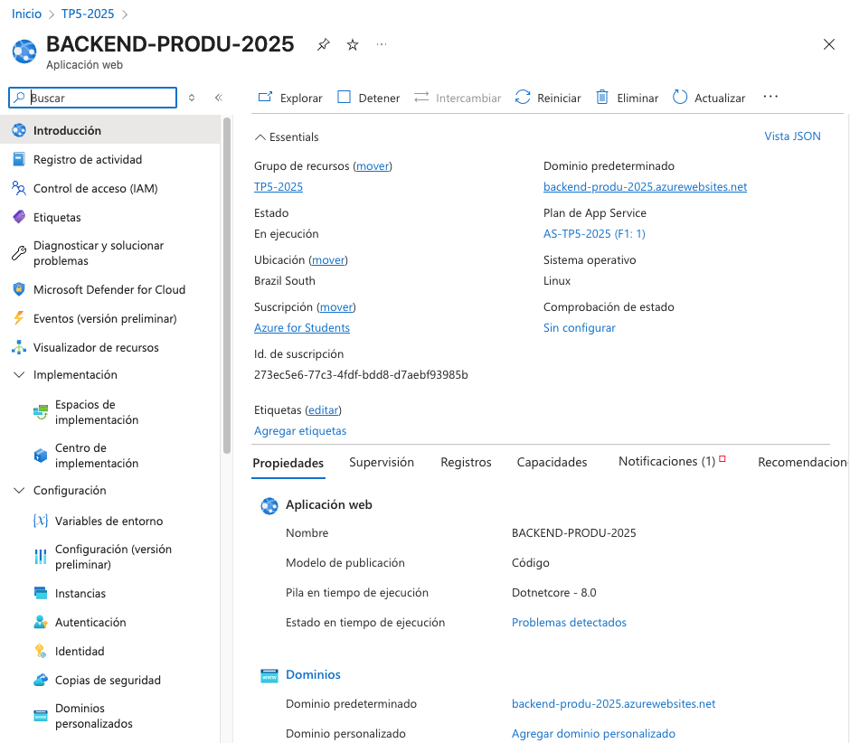
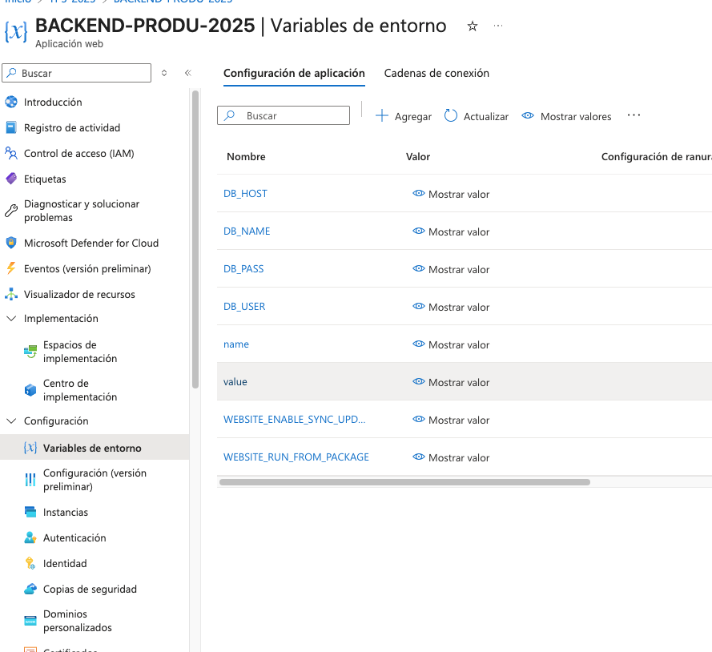
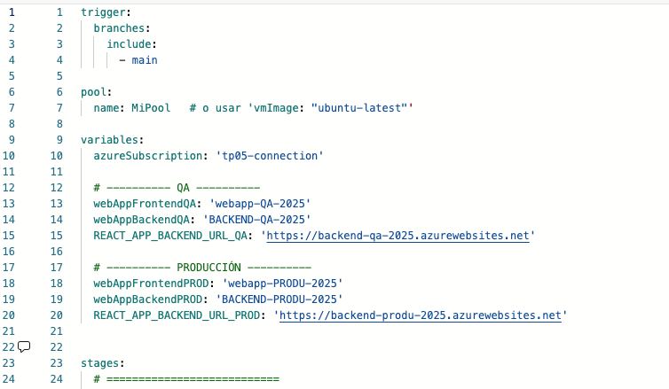
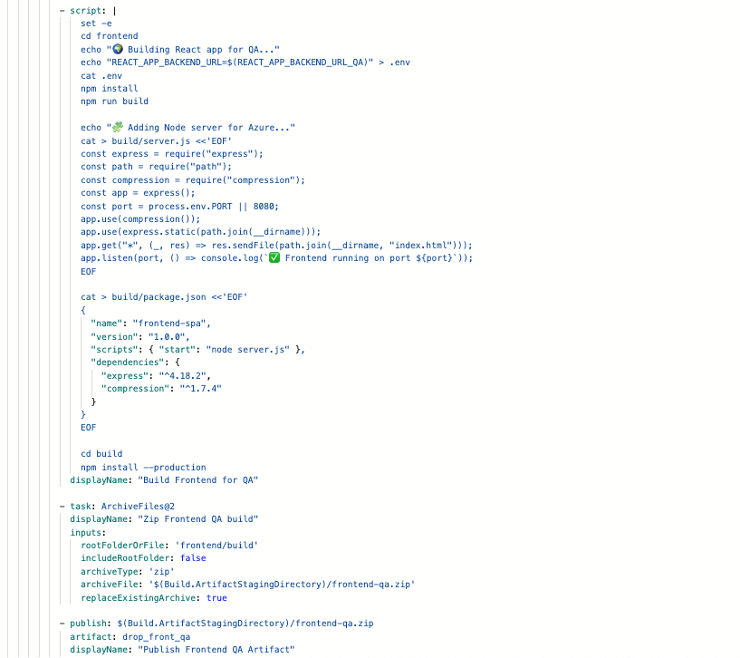
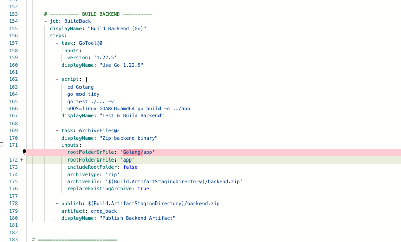
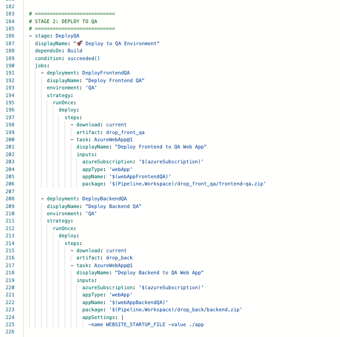
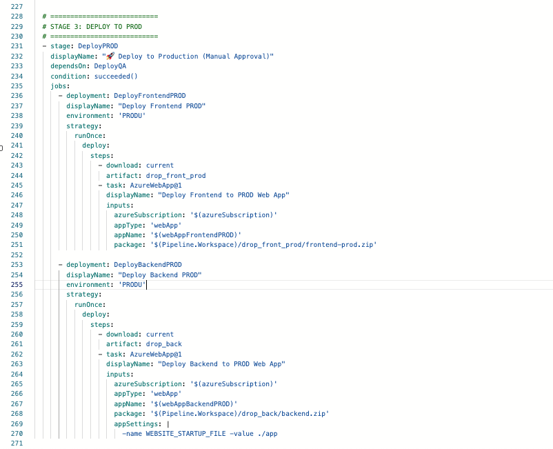

# Decisiones

<!-- Lista de imágenes: cada bloque tiene: encabezado con nombre, vista previa y campo para el título -->

### i1.png

**Título:** Creamos nuestras WEb apps (front y back - produccion y qa)

### i2.png

**Título:** Definimos las varibles de entorno de back
### i3.png

### i4.png

**Título:** Definimos en nuestor pipeline las urls y componenets de las webapps

### i5.png

**Título:** Pasamos a configurar todo nuestro pipeline para hacer los builds y deploysde qa y produ
### i6.png

**Título:** _Escribe el título aquí_

### i7.png

**Título:** _Escribe el título aquí_

### i8.png

**Título:** _Escribe el título aquí_

