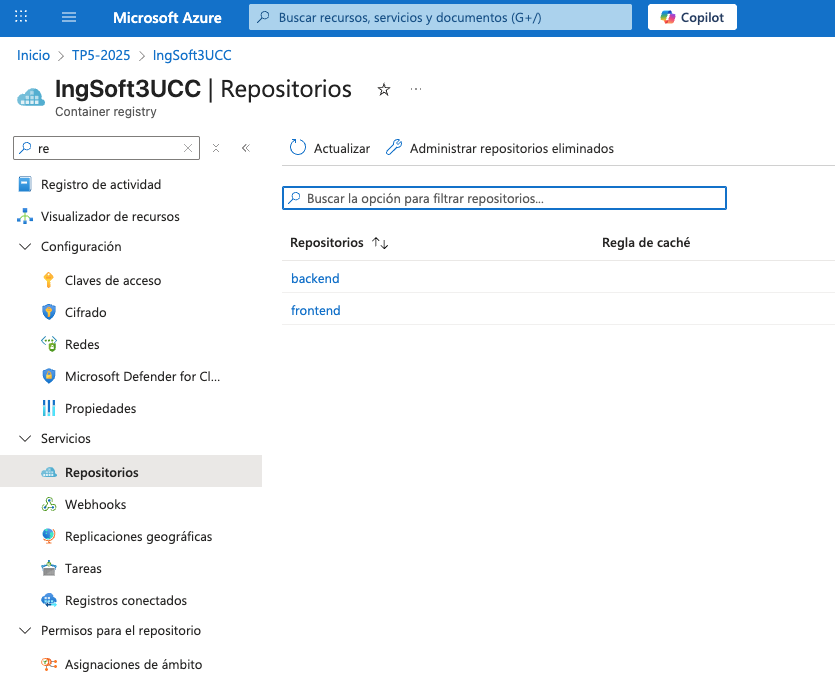
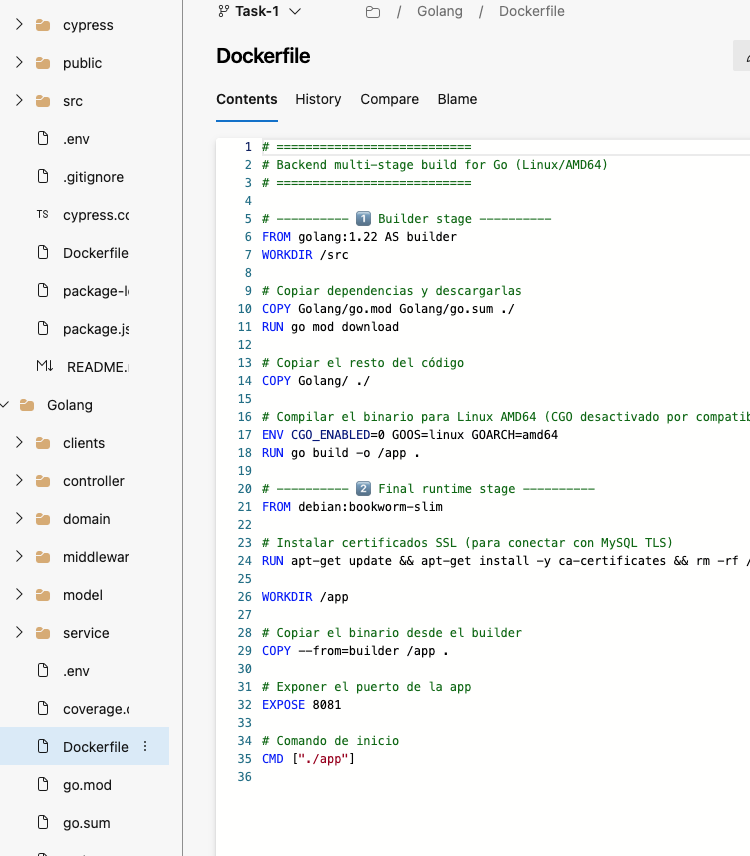
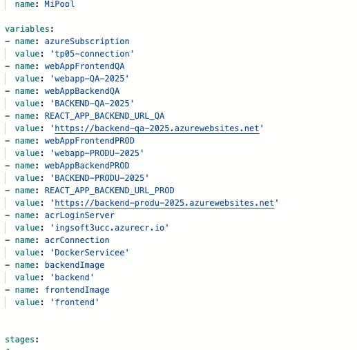
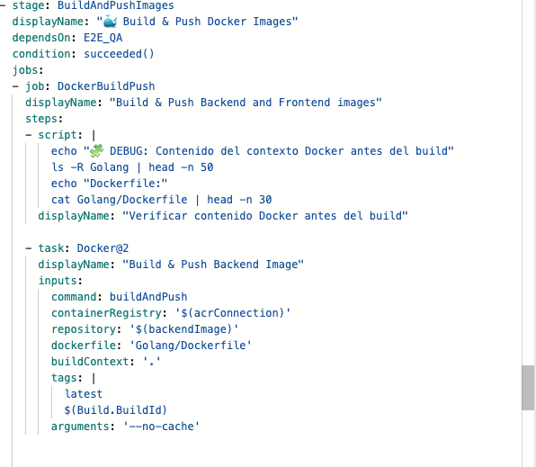
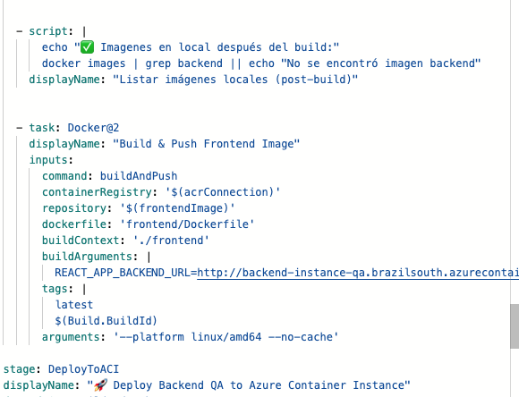
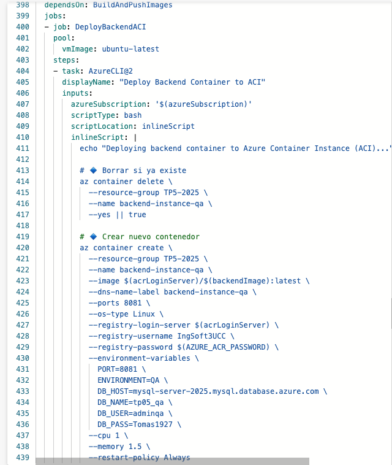

# Decisiones

## Imágenes (agregar título)

### image.png

**Título:** Creamos nuestra ACR
### i2.png

**Título:** Pasamos a configurar nuesto pipeline apra que acceda a la acr y para que podamos correr  nuestara imagenes docker y cargarlas en container definidos en el pipeline
### i3.png

**Título:** _Escribe el título aquí_

### i4.png

**Título:** _Escribe el título aquí_

### i5.png

**Título:** _Escribe el título aquí_

### i6.png

**Título:** _Escribe el título aquí_

